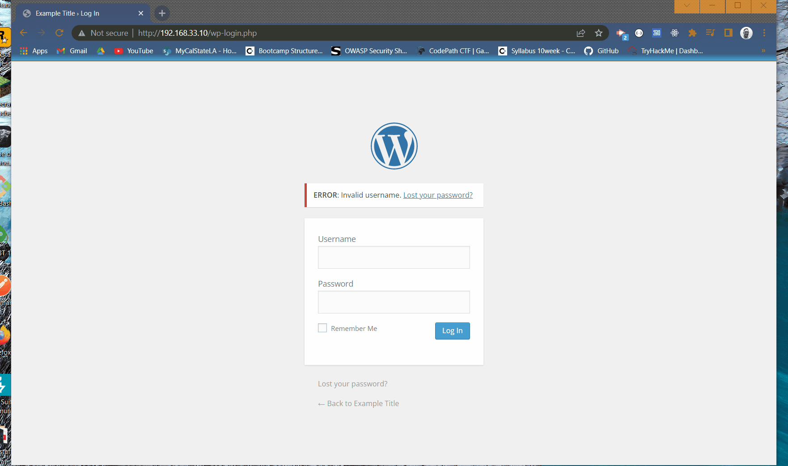
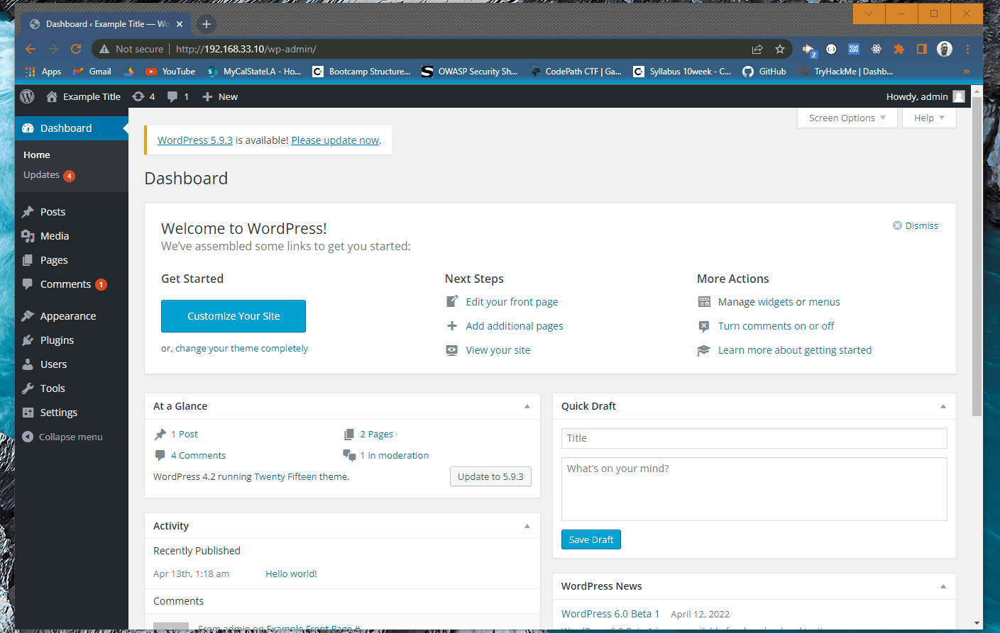

# WordPress Pentesting Report

# 1. User Enumeration (CVE-2020-7918)

- Type/Class of vulnerability:
  - Vulnerability type: User Enumeration
  - Tested in version: 4.2
  - Patched in version: 4.7.2
- GIF Walkthrough: 
- Steps to recreate:
  - Enter a known username such as admin or moderator in my case followed by an invalid password for that account.
  - An error message appears letting a user or attacker know that there is infact an account named admin.
  - With this new knowledge someone with malicious intent would be able to perform a brute-force attack using a wordlist or dictionary text in order to guess passwords on a known username.
- Source code:

  - [WordPress Github](https://github.com/WordPress/WordPress/commit/daf358983cc1ce0c77bf6d2de2ebbb43df2add60)

# 2. Authenticated Stored Cross-Site Scripting via Image Filename (CVE-2016-7168)

- Type/Class of vulnerability:
  - Vulnerability type: Cross-Site Scripting
  - Tested in version: 4.2
  - Patched in version: 4.6.1
- GIF Walkthrough: 
- Steps to recreate:

  - Signed in as Admin, go to the dashboard and verify that the uploaded image has a filename that includes the code below:

    `A`

  - Click on "View attachment page"
  - The application will load with the approved image and the XSS code will run.

- Source Code:
  - [WordPress Github](https://github.com/WordPress/WordPress/commit/c9e60dab176635d4bfaaf431c0ea891e4726d6e0)

# 3. Authenticated Stored Cross-Site Scripting in YouTube URL Embeds (CVE-2017-6817)

- Type/Class of vulnerability:

  - Vulnerability type: Cross-Site Scripting
  - Tested in version: 4.2
  - Patched in version: 4.7.3

- GIF Walkthrough: 

- Steps to recreate:

  - Signed in as Admin, go to the dashboard and click on the posts tab and verify that the post is embeded with the youtube URL link listed below:

    `[embed src='https://youtube.com/embed/12345\x3csvg onload=alert(1)\x3e'][/embed]`

  - Click on "Preview Changes"
  - The application will load with the approved post and the XSS code will run.

# 4 Authenticated Stored Cross-Site Scripting

- Type/Class of vulnerability:

  - Vulnerability type: Cross-Site Scripting
  - Tested in version: 4.1
  - Patched in version: 4.2.3

- GIF Walkthrough: 

## Resources

GIFs created with [ScreenToGif](https://www.screentogif.com/)
